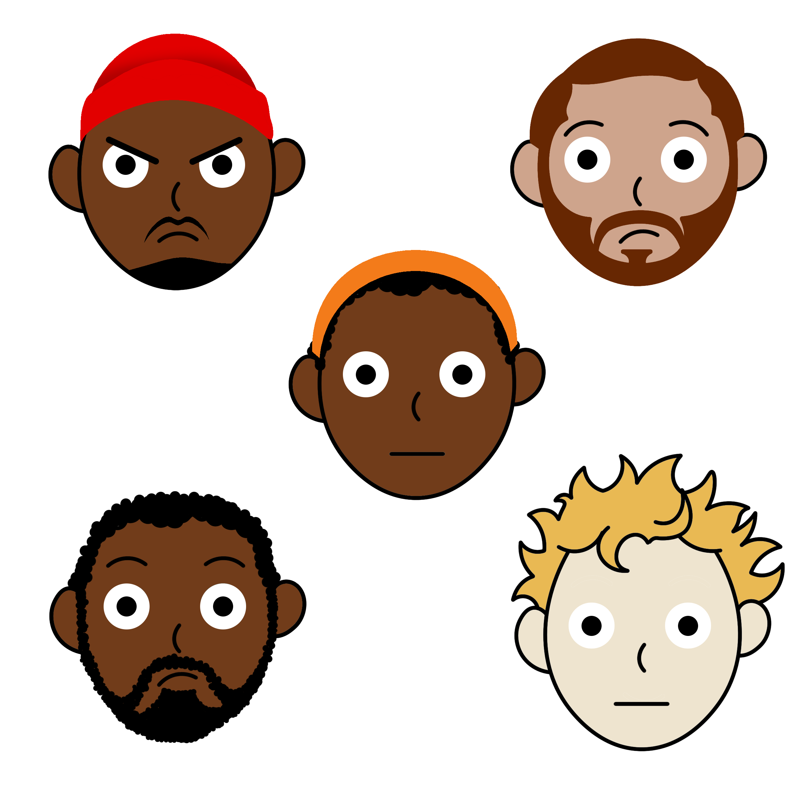

# Close Calptions

# Onderzoeksvraag

How could closed captions be enriched to give more meaning to Marie?

# Probleemdefinitie

Marie is Deaf (yes, with a capital letter - this means she identifies herself as Deaf, which basically means that her first language is Dutch Sign Language). As you can imagine, Marie struggles with things that heavily rely on sound.

Marie experiences a significant loss of nuance while watching movies or documentaries. Although many films provide closed captions, they are as neutral as possible.

# Oplossing

 I worked on the close captions to convey the characters' feelings, playing with the text to give different emotional levels. I zoomed in and out on the video to enhance the moments of stress, and added effects to highlight sound cues (What is it, and where is it in the frame when it's invisible?)

# Link prototype

🔗 [My finel versie](https://sundouskanaan.github.io/Close-Captions/versie3.html)

---
### inhoud
- [Close Calptions](#close-calptions)
- [Onderzoeksvraag](#onderzoeksvraag)
- [Probleemdefinitie](#probleemdefinitie)
- [Oplossing](#oplossing)
- [Link prototype](#link-prototype)
    - [inhoud](#inhoud)
- [Human Centered Design @cmda-minor-web 2022 - 2023](#human-centered-design-cmda-minor-web-2022---2023)
  - [Debriefing](#debriefing)
    - [**Marie van Driessche**](#marie-van-driessche)
  - [User Scenario](#user-scenario)
  - [First meeting](#first-meeting)
  - [First 2 prototypes](#first-2-prototypes)
  - [First test](#first-test)
  - [Evaluatie](#evaluatie)
  - [last prototype](#last-prototype)
- [Design principles](#design-principles)
  - [Study situation](#study-situation)
    - [my work](#my-work)
  - [Ignore conventions](#ignore-conventions)
    - [my work](#my-work-1)
  - [Prioritise](#prioritise)
    - [my work](#my-work-2)
  - [Add nonsense](#add-nonsense)
    - [my work](#my-work-3)
- [Last Evaluatie](#last-evaluatie)

---

# Human Centered Design @cmda-minor-web 2022 - 2023

In our class "Human Centered Design," we had an assignment to create a special design for a person with a disability. We had to choose a problem that they were experiencing and find a way to solve it with our design. The most important thing was to understand what the person we were designing for wanted and needed. We had to talk to them and test out our ideas to make sure it was a good fit for them. We wanted to make sure that our design was made just for them and would make their life easier.

## Debriefing

For this course, I have been given a design assignment that I will create for one individual - a real person. Each week, I must test my design and iterate to improve it. Eventually, I will have an exclusive design that is tailored specifically to this person. But who is this person for whom I am designing? What do they like or dislike? How do they use a computer? These are all important questions that I must consider in order to create a successful design.

### **Marie van Driessche**

Marie is Deaf (yes, with a capital letter - this means she identifies herself as Deaf, which basically means that her first language is Dutch Sign Language). As you can imagine, Marie struggles with things that heavily rely on sound.

Marie experiences a significant loss of nuance while watching movies or documentaries. Although many films provide closed captions, they are as neutral as possible. How could closed captions be enriched to give more meaning to Marie?

## User Scenario

Marie desires a more immersive and enhanced viewing experience, especially in situations where facial expressions may not be visible, clear, or accurately conveying emotions. She longs for an experience that bridges the gap created by her condition.

In this design, Marie can embark on a novel experience with various enhancements beyond mere translation. To heighten the sense of tension, visual effects on the screen will correspond to the intensity of the sound and its source, offering a more dynamic representation. Additionally, she will encounter a new dimension of emotions, such as tension arising from intense scenes or dialogues, through the innovative use of zooming techniques. Rather than relying on explicit speaker identification before each sentence, a subtle illustration will provide hints regarding the potential emotions and identities of the speakers, eliminating the need for constant name references.

The aim is to bring Marie closer to a more comprehensive understanding of the audiovisual content she consumes, enriching her perception and allowing her to delve deeper into the intended emotions and identities conveyed within.

## First meeting

My group and I had a discussion together before talking to Marie and shared our ideas and questions:

- Our assumptions:
    - Is it difficult to convey emotions through closed captions?
    - Can the font type/size be adjusted?
    - Is there difficulty in distinguishing between speakers?

- Questions:
    - Is there a difference between "deaf" and "Deaf" (with a capital letter)?
    - What are the challenges you face when listening to podcasts? (keep it somewhat broad and general)
    - Have you had a good experience with a specific app/service/media related to transcription/closed captions?
    - Do you happen to have an example of a problem you have experienced? (sentence can be rephrased)
    - When and where (context) do you usually listen to podcasts?
    - Do you have a favorite podcast?
    - Do you use any specific apps for listening to podcasts?
    - What adjustment options would you like to have regarding closed captions?

- Question order:
    - Is there a difference between "deaf" and "Deaf" (with a capital letter)?
    - Do you have a favorite podcast?
    - When and where (context) do you usually listen to podcasts?
    - Do you use any specific apps for listening to podcasts?
    - Have you had a good experience with a specific app/service/media related to transcription/closed captions?
    - What are the challenges you face when listening to podcasts? (keep it somewhat broad and general)
    - Do you happen to have an example of a problem you have experienced? (sentence can be rephrased)

- The most important results:

Marie is 34 years old and works as a UX designer. She was born deaf, but it is unknown why and it is not hereditary as nobody else in her family is deaf. Marie grew up using sign language and has learned to lip-read, although it can be challenging depending on the context and appearance of the speaker. During work meetings, Marie always has a sign language interpreter with her to ensure that she can follow along as sign language is her primary language. Ze is er trots op dat ze doof is en vindt het geen probleem.

She loves to watch series, TV programs. Movies a little less.

- Inconsistent quality of subtitles on Dutch TV.
- Lack of indication of who is speaking in the subtitles.
- Background noises are not included in the subtitles.
- Lack of context and missing information in the subtitles.
- Limited emotional nuance in the subtitles.
- Inability to convey all the information conveyed through spoken language in the subtitles.
- Overuse of obvious captions in some shows, like explosions.
- Difficulty in conveying nuances of spoken language, such as emotion or tone, through written captions.
- Challenges with displaying text for multiple people speaking at the same time.

- **Marie notes**:
    - It's important for me to see who is saying what. But if it's difficult to see, then adding the name would be helpful.
    - **Colors**: In the past, with the VPRO, they had colored subtitles where each person was assigned a specific color at the beginning of the series. So she kept that in mind. However, that has disappeared. The disadvantage of color theory is that in western culture, red is often associated with "danger". So the correct perspective should be taken into account. Colors and emotions are difficult to determine, as it can vary for everyone.
    - **Fonts for different situations**: It's possible and fun to experiment with, but I love reading and can imagine that if something is in all caps, it might seem like shouting to me.
    - Who is speaking, and where is the sound coming from?
    If a car comes into view, an explosion happens, and the car goes back to the other side, she doesn't know why this happened or where the sounds came from. I've gotten better at filling in the gaps, but it can be tiring.
    - **Customization options**: Colors, atmosphere. For example, if you see two people in conversation, I can often read their body language to tell if they're arguing or if it's an important discussion. But sometimes I can't tell, especially if the conversation is very intense and certain tones or speeds are not visible to me. This is often just literally translated. It would be valuable to know what the atmosphere is like or if someone is stuttering.
    - **Subtitles in 2 places**: Primary and secondary sounds. Primary sounds at the bottom. Subtitles easiest in the middle, because I'm used to it there. Sound effects distributed over the screen
    - **music**: Music in general is quite abstract to me. Distinguish the type of music (emotional / sad / disturbed ... etc.), be aware that sounds arouse certain emotions. She is aware of the rather loud noises. 

- **What do you expect from us?**

Subtitles are different from closed captions. She thinks closed captions are great, but she just misses the nuances in them. The feeling in it.

Closed caption styling adjustment, if we can make it more visually appealing to make it more interesting (whisper or shout for example).

## First 2 prototypes

For the test with Marie, I created a brief prototype where I worked with captions.

 My plan is as follows:
- Use photos instead of names (is that something she would enjoy?)
- Illustrations of people to show the speaker and their emotions while speaking.
- Two sentences stacked on top of each other (the top one is the old one with smaller font size and the bottom one is the new one with normal font size).
- Ask questions about zooming in and out and the emotion that needs to be conveyed during stressful moments.
- Discuss whether photos or illustrations work better.
Learn from other group members.

## First test

Marie's feedback on my work:
- Nice, there is emotion in the different icons.
- Uncertain about the intention of the emoji feelings.
- A bit distracting to have two lines of subtitles (due to an experience in Belgium where there were double subtitles of two different languages overlapping).
- Illustrations are more interesting than photos because the emotion is already in the illustration. But can I visually express all emotions? Sarcasm, for example, is difficult in sign language!
- Zooming in on the video in certain situations? Marie: "Good question... never really thought about it. Very interesting and fun to see how you could apply it."
- Marie: "If you can translate this distinction (hearing how someone feels), that's fun."

Marie's notes on other people's work that I find nice to try:
- Play with the font size and transform.
- Introduce icons first
- Work on the sounds, how high it is and where it is coming from.

## Evaluatie

There is no bad test because it is possible to learn from feedback to improve the work. I will work on learning feedback about my own work and feedback from others that is suitable for my work to try.

I will work on the following points:

- Trying to create illustrations that can capture the ironic feeling of a sentence.
- Providing illustrations at the beginning to explain the likely feeling.
- Use a single translation sentence instead of a double translation.
- Using the experience of zooming in and out to convey the feeling of tension at that moment. 
- Making clear the inner feeling of the speaker (if they claim a different feeling from the way they speak).
- Playing with text to improve interaction with the scene.
- Adding invisible sounds to the scene in a way that is not disruptive while watching.

## last prototype

I worked on the points I got from the test and this is what my prototype came to:

**I played around with the font style of the text to give strong Marie effects, like capital letters for screaming moments.**

**Illustrations are not only for showing the speaker, but also for conveying his feelings in several cases, for example: perhaps the speaker is in the background, or he cannot be seen, or a face appears that does not represent his true feeling during the speech (example: Carmen thanks, but he is still not satisfied).**

**For background sounds only, I created a sound wave effect that is where the sound is coming from or its direction if it's completely outside the frame as the intensity of the sound varies depending on why and how it's made, and I made a note at the top of the video about the type of sound and the symbol Emoticon to provide a faster overview of the cause of the sound.**

**To enhance the scenes of tension or surprise, I added the effect of zooming in and out, because naturally, a person gets nervous when another person approaches him excessively, and Marie was excited to try it and see the result.**

The origine scene

My scene with zoomin

**To directly clarify the purpose of each illustration, I added a simple explanation screen at the beginning of the video to show an example of the illustration and its closest significance. I also added the double graphic to show the real feelings that the speaker's face may not reflect, which may also work to show the real feeling behind the serious jokes.**

# Design principles

## Study situation

To become specialized designers for individuals with various disabilities, we need to study different and unique situations.

### my work

My team and I collected our current inquiries and ideas into one [file](https://docs.google.com/document/d/1LDvOvYqQnEArSfly82C-WOUW9OdvcDLzjdc0qaiFU7Q/edit) with the aim of making it easier to communicate with Marie and also to learn from each other. We learned different things about her, such as her work, where she watches TV series and films, and what films she is interested in. We also understood her thoughts on various matters and what bothers her with the current close captions.

Marie is Deaf (yes, with a capital letter - this means she identifies herself as Deaf, which basically means that her first language is Dutch Sign Language). As you can imagine, Marie struggles with things that heavily rely on sound. 

- Foor all details check [First meeting](#first-meeting)

## Ignore conventions

The existing conventions in design are primarily established by and targeted towards designers. Nevertheless, not all of these conventions are applicable or user-friendly for non-designers. In order to ensure inclusivity, especially for individuals with disabilities, it is crucial that we reassess these conventions by conducting comprehensive research into their unique circumstances.

### my work

As designers, we are used to making the design according to our assumptions or information that we collect about and from the target group, but we forget that people with handicap may be from the target group, but the design may not suit them, so they find it difficult to use it, and this is of course bad. Because we forget them, we do not consider their condition and needs to facilitate access in our design.

Therefore, I designed illustrations and used them in my captions in place of names, because they provide a new way to display different things at once, such as the identity of the speaker, his feelings, thoughts and psychological state. Showing the intensity and location of the sound emanating in the background instead of including that in the captions. Marie does not want to know the cause of the sound, but she wants to know its location and intensity, and if possible the feeling it generates for the listener.

## Prioritise

By incorporating marginalized individuals into our design process, viewing them as collaborative designers rather than mere subjects of study, we can foster the creation of innovative and impactful conventions.

### my work

When it comes to Marie, who has been deaf since birth, I approached the task with the awareness that she doesn't experience the sensations tied to sound—their intensity or emotional expression. Consequently, I made a conscious effort to convey everything visually, ensuring it wouldn't pose any inconvenience. My aim was to offer a viewing experience that deviates from the conventional style, one that is imbued with a distinct flavor, encompassing emotions and clarity that might otherwise be absent.

## Add nonsense

Approaching design for individuals with disabilities is largely an unexplored realm, where nonsense can serve as a valuable tool for delving into the unfamiliar. Moreover, it brings an element of enjoyment to the process.

### my work

Marie is an adventurous individual who is always willing to explore new things and determine their suitability. With this in mind, I decided to experiment with the zoom effect after realizing that she hadn't previously noticed its impact on her while watching. Additionally, I incorporated illustrations to provide a fresh and captivating element, enhancing the expression of the speaker's emotions, which Marie felt were lacking.

---

# Last Evaluatie

The test we did was very informative and useful and accordingly I have the following list to check out:

- Create illustrations that can capture different emotions, both obvious and hidden. ✅
- Indicating the expected purpose of the illustrations from the outset, so that it is easy to recognize their purpose as soon as they are glimpsed. ✅
- Use a single translation sentence instead of a double translation. ✅
- Using the experience of zooming in and out to convey the feeling of tension at that moment. ✅
- Making clear the inner feeling of the speaker (if they claim a different feeling from the way they speak). ✅
- Playing with text to improve interaction with the scene. ✅
- Adding invisible sounds to the scene in a way that is not disruptive while watching. ✅
- Enhance the sfeer feeling while watching. ✅
- Clarifying what is invisible or outside the frame of the screen, which may cause a sudden change in the mood of the characters. ✅

Nice to have:

- Add vibration to a device close to the user.
- Animation for illustrations.
- Trying to make the sound effect different according to the cause, not just its intensity